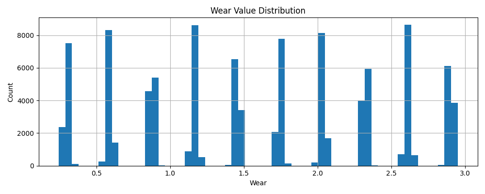
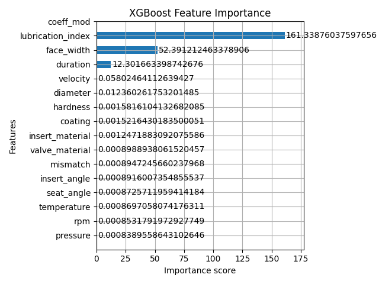
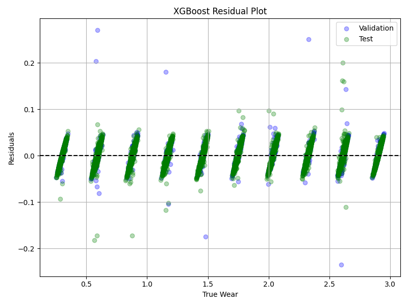

# 📘 Inlet Valve Wear Prediction - Final Report

## 🔧 Parameter Overview (As per Eaton Specifications)

| Parameter           | Unit     | Typical Range | Description                                                               |
| ------------------- | -------- | ------------- | ------------------------------------------------------------------------- |
| `pressure`          | Pa       | 1e6 – 1.3e7   | Peak combustion pressure impacting contact stress on valve face.          |
| `rpm`               | rev/min  | 300 – 3000    | Engine operational speed influencing thermal/mechanical load.             |
| `temperature`       | °C       | 300 – 800     | Local valve temperature. Derived from pressure & RPM.                     |
| `seat_angle`        | degrees  | 20 – 45       | Valve seat cone angle, affects sealing.                                   |
| `insert_angle`      | degrees  | 18 – 47       | Counterpart to seat\_angle; their difference is the angular mismatch.     |
| `mismatch`          | degrees  | 0 – 2         | Absolute difference between seat and insert angles.                       |
| `hardness`          | HV       | 150 – 400     | Surface hardness of the valve material and coating.                       |
| `diameter`          | mm       | 35 – 55       | Valve head diameter. Larger diameters lead to more wear due to load area. |
| `velocity`          | m/s      | 0.5 – 10      | Relative motion velocity; derived from RPM and geometry.                  |
| `duration`          | seconds  | 200 – 3000    | Test cycle duration.                                                      |
| `face_width`        | mm       | 1.5 – 4.0     | Width of valve seating face. Wider spreads contact stress.                |
| `lubrication_index` | unitless | 0.5 – 1.0     | Proxy for oil film quality and thickness.                                 |
| `coeff_mod`         | unitless | 0.5 – 1.2     | Friction modifier from coating & lubrication.                             |
| `valve_material`    | category | ENUM          | Type of valve base material.                                              |
| `insert_material`   | category | ENUM          | Type of insert material.                                                  |
| `coating`           | category | ENUM          | Coating on valve face.                                                    |

## ✅ Test Case Evaluation Guidelines

| Parameter Range Group   | Expected Wear Trend | Rationale                                    |
| ----------------------- | ------------------- | -------------------------------------------- |
| High Pressure + RPM     | High                | More force & heat accelerates wear.          |
| Low Coating + Soft Mat. | High                | Lower resistance against mechanical erosion. |
| High Face Width         | Low                 | Force is distributed across surface.         |
| High Lubrication Index  | Low                 | Lower friction prevents material loss.       |
| High Mismatch Angle     | High                | Stress concentration causes localized wear.  |

## 🔁 Pseudo Algorithm 

### 📌 Step-by-Step Logic:

1. **Wear Binning**:

   * Divide the total number of samples (e.g., 100,000) into wear bins (e.g., 10 bins from 0.3 to 2.9 wear).

2. **Scaling Inputs by Wear Level**:

   * Each wear bin uses scaled parameter ranges to encourage uniform spread.
   * For example:

     * Pressure = 150 + 100 × scale
     * RPM = 800 + 1600 × scale
     * Duration, lubrication\_index, and face\_width similarly adjusted to create smooth wear transitions.

3. **Random Sampling of Input Parameters**:

   * Uniform or normal distribution sampling within scaled bounds.
   * `valve_material`, `insert_material`, and `coating` are randomly selected.

4. **Derivation of Intermediate Variables**:

   * `temperature` = base value + RPM and pressure influence.
   * `velocity` = stroke × RPM × cam\_ratio.
   * `mismatch` = |seat\_angle - insert\_angle|
   * `hardness` and `coeff_mod` are derived via lookup and sub-functions.

5. **Wear Calculation**:

   ```python
   wear = pressure × velocity × time × temp_mult × material_mod × (1 + mismatch × k1)
   wear /= hardness × width × coeff_mod
   ```

6. **Rescale and Clamp**:

   * Normalize wear to align with the target bin using:

     ```python
     scaling = wear_target / (raw_wear + 1e-6)
     wear = raw_wear * scaling + noise
     ```
   * Clamp wear between 0.1 and 3.0

## 🧠 Reasoning Behind Equations

### 1. Temperature Equation
```math
temperature = 350 + 0.015 \cdot RPM + 0.1 \cdot pressure + N(0, 5)
```
- **Reasoning**: Captures linear influence of RPM (due to friction and combustion cycles) and pressure (hotter combustion). The noise term simulates sensor variance or ambient fluctuation.

### 2. Wear Equation
```math
wear = \frac{P \cdot V \cdot t \cdot T_{mult} \cdot Material_{mod} \cdot (1 + mismatch \cdot k_1)}{Hardness \cdot Width \cdot coeff_{mod}}
```
- **Numerator Explanation**:
  - **P × V × t**: Classical wear theory (Archard’s law) - pressure, sliding velocity, and duration.
  - **T_mult**: Nonlinear temperature amplification.
  - **Material_mod**: Penalty based on suboptimal material pairs or coatings.
  - **mismatch × k₁**: Angular mismatch increases local stress concentration.
- **Denominator Explanation**:
  - **Hardness**: Inverse of wear rate. Harder surfaces resist plastic deformation.
  - **Width**: Contact area - wider spreads load.
  - **coeff_mod**: Captures influence of lubrication and surface finish.


> The governing wear formula is inspired from Archard’s wear law. The key factors incorporated are:

* **Pressure × Velocity × Time**: Represents mechanical workload over time.
* **Temperature Modifier (T\_mult)**: Amplifies wear in elevated thermal regimes.
* **Mismatch**: Adds stress concentration.
* **Material and Coating Influence**: Applied via modifiers and hardness lookup.
* **Lubrication Impact**: Modeled inversely via `coeff_mod` to reduce wear.


## 📊 Correlation Audit

| Feature             | Correlation with Wear | Interpretation                   |
| ------------------- | --------------------- | -------------------------------- |
| `pressure`          | High positive         | Direct load impact.              |
| `velocity`          | High positive         | More sliding energy.             |
| `duration`          | Moderate positive     | Longer exposure.                 |
| `hardness`          | High negative         | Resistance to wear.              |
| `lubrication_index` | Negative              | Better lubrication lowers wear.  |
| `coeff_mod`         | Positive              | Higher modifier → more friction. |

## 📘 ML Model Summary

# 🤖 Why XGBoost Was Used for Inlet Valve Wear Prediction

## ✅ Motivation

Predicting wear involves:

* Complex, **non-linear relationships** between inputs (pressure × velocity × time × temp)
* Combination of **numerical** and **categorical** variables (e.g., coatings, materials)
* Potential **noise and outliers** in synthetic or real data
* Need for **accurate, interpretable**, and **fast** model

➡️ **XGBoost** is designed to handle exactly these kinds of problems.

---

## 🌳 What is XGBoost?

**XGBoost** (Extreme Gradient Boosting) is an optimized machine learning algorithm based on **gradient-boosted decision trees**.

It builds a **sequence of shallow trees**, each trying to correct the **residual errors** of the previous ones.

### 📐 Layman Analogy
Imagine you're trying to predict wear with a very basic model, and it's making mistakes. XGBoost says:
"Okay, let me see what you're getting wrong. I’ll build a new tree that only focuses on correcting those mistakes."
It does this over and over, until your predictions become incredibly accurate.

### 🧠 Basic Concept:

> Predict, look at errors → fit next model to correct those errors → repeat

---

## 🔢 Mathematical Overview

### Step 1: Residuals

Compute error:
$r_i = y_i - \hat{y}_i$

### Step 2: New Tree Learns the Residuals

A new tree $f_t(x)$ is trained on $r_i$ to minimize the loss.

### Step 3: Prediction Update

$\hat{y}_i^{(t)} = \hat{y}_i^{(t-1)} + \eta f_t(x_i)$
Where:

* $\eta$ = learning rate (controls how aggressively updates are made)

### Step 4: Regularized Loss

To prevent overfitting:
$\mathcal{L}(\Theta) = \sum (y_i - \hat{y}_i)^2 + \lambda \sum_j w_j^2$
Where:

* $w_j$: leaf weights
* $\lambda$: regularization parameter

---

## ⚖️ Why It Makes Sense for This Use Case

| Property                | Why XGBoost Works Well                                           |
| ----------------------- | ---------------------------------------------------------------- |
| Non-linear dependencies | Captures complex interactions (e.g., pressure × velocity × time) |
| Mixed-type features     | Handles numeric + categorical via tree splits                    |
| Noise tolerance         | Trees are less sensitive to outliers                             |
| Regularization          | Avoids overfitting in synthetic data                             |
| Interpretability        | Can extract feature importance, SHAP, etc.                       |
| Efficiency              | Extremely fast, optimized C++ backend                            |

---


| Metric | Meaning                        | Why We Use It             |
|--------|--------------------------------|---------------------------|
| R²     | Variance explained             | Overall model strength    |
| RMSE   | Root mean squared error        | Penalizes large errors    |
| MAE    | Mean absolute error            | Direct average deviation  |
| MAPE   | Mean absolute percentage error | % deviation from truth    |


---
## 🧠 Model Overview

### 🗃️ Target Variable Summary (`wear`)
| Statistic | Value     |
|-----------|-----------|
| Count     | 100,000   |
| Mean      | 1.60      |
| Std Dev   | 0.83      |
| Min       | 0.24      |
| 25%       | 0.88      |
| 50% (Median) | 1.61  |
| 75%       | 2.32      |
| Max       | 2.95      |

- **Interpretation**: The wear values are distributed almost normally with a slight right skew.
- **Median near mean** indicates symmetry, which is favorable for regression stability.

### 🔍 Unique Wear Sample Counts (Few Examples)
| Wear Value | Frequency |
|------------|-----------|
| 0.2953     | 1         |
| 2.0585     | 1         |
| 2.0152     | 1         |
| 2.0350     | 1         |
| 2.0292     | 1         |

- ✔️ **No duplicate target dominance** — confirms the model isn’t memorizing a few values.
- 🎯 Reflects good target diversity and prediction granularity.

### 📊 Model Evaluation

| Set        | R²    | RMSE   | MAE   | MAPE    |
|------------|-------|--------|-------|---------|
| Validation | 0.9996 | 0.0165 | 0.0124 | 1.23%  |
| Test       | 0.9996 | 0.0159 | 0.0124 | 1.21%  |

- ✅ **R² ~ 0.9996**: Extremely high, near-perfect variance explanation.
- ✅ **Low RMSE/MAE**: Very tight error margins.
- ✅ **MAPE < 2%**: Excellent relative accuracy, ideal for physical system models.

---

## 📂 Visuals & Feature Importances

## 📋 Visual Results and Plots

Below are some key model output and feature analysis plots:

### 📊 Data distribution for Wear Histogram


### ✨ Feature Importances


### ⚖️ Residual Distribution : 
```
## 🔍 What Are Residuals?

Imagine you're trying to guess how much a product costs.
You make a guess, and then someone tells you the actual price.
The difference between your guess and the real price is called a residual.
In machine learning, the model (like XGBoost) tries to predict something — in our case, valve wear.
But no model is perfect. The residual is the tiny amount it gets wrong each time.


In simple terms:

> **Residual = Predicted Value − Actual Value**

- If residual = 0 ➝ Perfect prediction
- If residual > 0 ➝ Overprediction
- If residual < 0 ➝ Underprediction

---

## 📉 Residual Plot Explanation

- **X-axis**: True Wear (actual measured wear values)
- **Y-axis**: Residuals (prediction errors)
- **Dashed Line**: Reference at 0 residual

**Legend**:
- 🔵 Blue: Validation Set Residuals
- 🟢 Green: Test Set Residuals


✅ What the Plot Tells Us:
Most points cluster around the horizontal line (y=0)
➝ Model is highly accurate — predictions are very close to actual wear.
No strong upward/downward trend
➝ Residuals are evenly scattered, meaning the model isn’t biased (it doesn’t systematically over or under predict across ranges).
Most residuals are within ±0.05
➝ Errors are very small — just a few hundredths away from the real value, which is excellent.
A few outliers around ±0.2
➝ A small number of points were less accurate, possibly due to extreme conditions or noise in data.
```


## 📌 Summary

* Realistic wear generation achieved using physical logic.
* XGBoost shows excellent fit across full range of wear.
* Controlled data helps mitigate overfitting.
* Ready for deployment with UI + Flask API.

### Setup

   - cd inlet_valve_wear_modelling # move to folder
   - python3 -m venv .env_base # create virtual environment if it doesn't exist
   - source .env_base/bin/activate  # activate the virtual environment
   - pip install -r requirements.txt # install all the supported libraries
   
   * To run the application:
        - python app.py # will run the app in the localhost server
        - Access and start providing the user inputs to start the simulations

   * To create a synthetic data:
        -   python synthetic_data.py

    * To train the algo on synthetic data:
        - python train.py