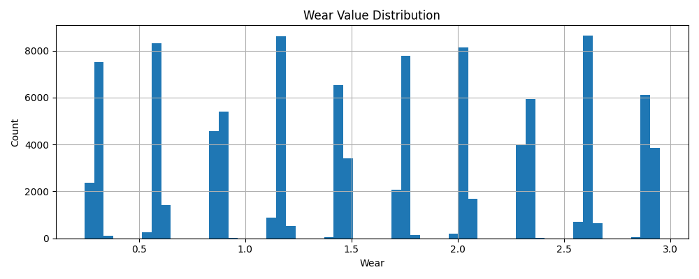
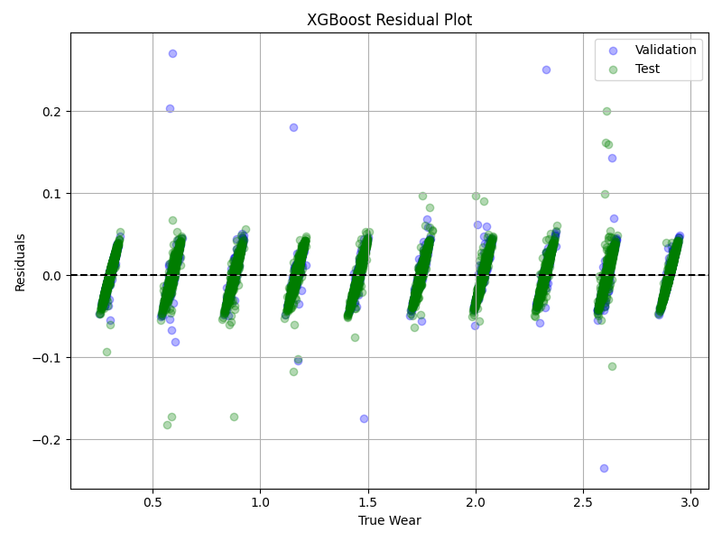

## Introduction

-----

## Parameters details

- Two important things required to train the model:
    - lot of sample data covering different diversity so that model understands how the variations are happeing with change in the parameters
    - for each diversity there should be sufficient number of samples so that model can understand the pattern. if we take just 1 sample for each diversity of data it will never learn.
    - lot of important features, if we take features which are not related to the wear prediction it doesn't make any sense and thus confuse the algorithm

- How we found these parameters:
    - these parameters are union of all the parameters that we found after going through multiple research papers solving the similar problem statement ( list down references in the end )

- Why we were unable to takee the test cases shared with us :
    - as first of all we only had 27 test cases
    - as they didn't had lot of information on these parameters and making the realistic assumptions just seeing the data on all these parameters seams very random.

- Information about the parameters given below:

| Parameter           | Unit     | Typical Range | Description                                                               |
| ------------------- | -------- | ------------- | ------------------------------------------------------------------------- |
| `pressure`          | Pa       | 1e6 – 1.3e7   | Peak combustion pressure impacting contact stress on valve face.          |
| `rpm`               | rev/min  | 300 – 3000    | Engine operational speed influencing thermal/mechanical load.             |
| `temperature`       | °C       | 300 – 800     | Local valve temperature. Derived from pressure & RPM.                     |
| `seat_angle`        | degrees  | 20 – 45       | Valve seat cone angle, affects sealing.                                   |
| `insert_angle`      | degrees  | 18 – 47       | Counterpart to seat\_angle; their difference is the angular mismatch.     |
| `mismatch`          | degrees  | 0 – 2         | Absolute difference between seat and insert angles.                       |
| `hardness`          | HV       | 150 – 400     | Surface hardness of the valve material and coating.                       |
| `diameter`          | mm       | 35 – 55       | Valve head diameter. Larger diameters lead to more wear due to load area. |
| `velocity`          | m/s      | 0.5 – 10      | Relative motion velocity; derived from RPM and geometry.                  |
| `duration`          | seconds  | 200 – 3000    | Test cycle duration.                                                      |
| `face_width`        | mm       | 1.5 – 4.0     | Width of valve seating face. Wider spreads contact stress.                |
| `lubrication_index` | unitless | 0.5 – 1.0     | Proxy for oil film quality and thickness.                                 |
| `coeff_mod`         | unitless | 0.5 – 1.2     | Friction modifier from coating & lubrication.                             |
| `valve_material`    | category | ENUM          | Type of valve base material.                                              |
| `insert_material`   | category | ENUM          | Type of insert material.                                                  |
| `coating`           | category | ENUM          | Coating on valve face.                                                    |


## ✅ Additional context taken into acount to make the data more realistic

| Parameter Range Group   | Expected Wear Trend | Rationale                                    |
| ----------------------- | ------------------- | -------------------------------------------- |
| High Pressure + RPM     | High                | More force & heat accelerates wear.          |
| Low Coating + Soft Mat. | High                | Lower resistance against mechanical erosion. |
| High Face Width         | Low                 | Force is distributed across surface.         |
| High Lubrication Index  | Low                 | Lower friction prevents material loss.       |
| High Mismatch Angle     | High                | Stress concentration causes localized wear.  |


As we have all these general contexts, like eg. when the pressure is high and rpm is also high the wear will be high compared to when they both are low keeping other things constant. Similary lets say we have the high lubrication index, it will reduce the wear. **So all these context we need to take into account while creating synthetic data so that it becomes closer to realistic scenarios.**

## 🔁 Pseudo Algorithm 

Now we are presenting the methodology, this is not exactly mentioned on some equations given in the literature exactly but yes it is inspired based on them. There are some intutions based modifications done to build the synthetic dataset to make it closer to realistic scenario.

1. First we need to define the number of samples required to train our model. As its the machine learning model we decided to build appx 100000 sample data points so it has sufficient data to understand the pattern and learn from it.

2. Wear is the target variable. We used binning methodology to build a diverse dataset and maintain the distribution/frequency of each varities of data from low wear to high wear. Why its important? Let say we have to take 1000 samples from 0-100, if we take all of them within the range of 90-100 its not good. Model will never able to learn the other patterns. 

What is binning method - 
so lets say from 0-100 we need 1000 samples. we can define bin size as 10. for each bin we should take 100 values. so our model is able to learn all the patterns. Now within this each bin we can take uniform sample points which are uniform random distribution.

We can show the graph here represnting the bins.

### 📊 Data distribution for Wear Histogram



3. Now we factor in correlation between the parameters. This is done based on the additional context given. We use rule based methodology to control the factors as mentioned in section : Additional context taken into acount to make the data more realistic.

We kept some coefficients to decide the dependecny of one parameter and the level of impact on each other. Also if you see we want to achieve the distribution of target variable uniformly so what we did is kept a coefficient scale which determines how severe should be the wear. The coefficient is between 0-1. the more closer it is to 1, higher should be the wear. so if we control the distrbution based on this coefficient we can also control the wear data distribution.

```
    Now how we control the parameters based on these behind the scene, lets take example : 

    1. Pressure = 150 + 100 × scale
        Why this?
        - Assumption : Base Pressure = 150 bar taken for low combustion pressure.
        - 100 bar × scale provides a linear progression as wear severity increases. So:
            - scale = 0 → Pressure = 150 bar (lowest)
            - scale = 1 → Pressure = 250 bar (highest)

    2. RPM: Formula: RPM = 800 + 1600 × scale
        RPM controls how frequent the impacts are per second. Higher RPM = more valve contact = more wear.
        Why this?
        - Assumption: 800 RPM → idle engine speed (low load)
        - 800 + 1600 = 2400 RPM → high load engine speed
            - scale = 0 → idle-like scenario
            - scale = 1 → high-load, full throttle
            
    3. Other parameters like: Duration, Lubrication Index, Face Width
        - These are scaled similarly to match realistic behavior:
        - Parameter	        | Behavior	                    | Scaling Logic
        Duration	        | Longer time → more wear	    | 200s to 3000s
        Lubrication Index	| Lower lubrication → more wear	| 1.0 (ideal) to 0.5 (bad)
        Face Width	    | Narrower face → more stress	| 4.0 mm to 1.5 mm
        - So, for each: value = max − ( range × scale )
        - E.g.:
            - Lubrication = 1.0 - 0.5 × scale
            - Face Width = 4.0 - 2.5 × scale
        - These are reverse-scaled, meaning worse conditions (low lubrication, narrow face width) are assigned to higher wear bins.    
    4. Similary we made a lookup table and keep a rule based logic to select the right material and coatings, based on the wear. We will be selecting and covering all diversity mainting the realistic behaviour.

    Sample lookup table, this is to explain the context and methodology, we can further modify these, add new material data and other inputs: 
        - VALVE_MATERIALS = ['EMS200', 'X45CrSi9-3', '21-4N']
        - INSERT_MATERIALS = ['Ni-resist', 'Stellite', 'Inconel']
        - COATINGS = { 'None': 1.0, 'Chromium Nitride': 0.9, 'Titanium Nitride': 0.85, 'Thermal Spray': 0.92 }
        - HARDNESS_LOOKUP = { ('EMS200', 'Chromium Nitride'): 45, ('X45CrSi9-3', 'Titanium Nitride'): 48, ('21-4N', 'Thermal Spray'): 50, ('EMS200', 'None'): 35, ('21-4N', 'None'): 38 }
        - MATERIAL_MODIFIERS = { 'EMS200': 1.0, 'X45CrSi9-3': 0.95, '21-4N': 1.05 }

        Note: the insert material refers to the material used for the valve seat insert, which is the mating surface inside the cylinder head where the valve face comes into contact when it closes.

```    

4. **Derivation of Intermediate Variables**:

   * `temperature` = base value + RPM and pressure influence.
   ```
    - We know that temperature = base value + RPM and pressure influence

    - We start with a base valve temperature (say 300°C) and then add extra heat based on how fast the engine is running (RPM) and how much pressure is applied during combustion.

    - Why it makes sense:
     - Faster engine (RPM) → more combustion cycles per minute → more heat generated.
     - Higher pressure → more intense combustion events → again, more heat. So, both increase the thermal load on the valve.
     - Imagine a bicycle brake pad — the more and faster you press it, the hotter it gets. Same idea here: more motion and force = more heat.

    - Asssumption:
        - We know temperature increases with RPM and pressure.
        - But the exact formula used (like T = 300 + a * RPM + b * Pressure) is an approximation to keep it simple and computational.
   ```

   * velocity = (how far it moves) × (how often it moves) × (correction factor)
     
   ```
    - velocity = stroke × RPM × cam_ratio
    - It estimates how fast the valve is moving up and down based on how far it travels per stroke, how many times per minute it does that, and a scaling factor (cam_ratio).

    - Why it makes sense:

        - The valve’s motion is controlled by the camshaft.
        - So, more RPM = more movement per minute.
        - Stroke is how far it moves.
        - Cam ratio adjusts for the camshaft's mechanical characteristics (not all cam designs produce the same speed).
        - Like a piston going up and down — if it moves farther and faster, its velocity increases.

    - Assumption:
        - Stroke is usually a fraction of valve diameter (here ~10% is used). Because in most real engines, valves don’t move very far — just a small fraction of their size. We chose 10% as a safe and simple estimate to represent that motion realistically.
        
        - The camshaft controls how fast and far the valve moves. But not all valves open and close the full RPM number of times — some engines make valves move slower than the crankshaft. So we multiply by a factor (like 0.6) to reflect that the valve’s actual movement is only a portion of the RPM.


    ```
   * `mismatch` = |seat\_angle - insert\_angle|
   ```
   - mismatch = absolute difference between seat angle and insert angle

    - It estimates the angular misalignment between the valve seat and insert.
    - A perfect match would mean 0° mismatch — both angles align exactly.

    - Why it makes sense:

        - In real engines, the valve seat and the insert (the part it contacts) might be machined with slightly different angles.
        - This mismatch causes uneven contact → leading to **stress concentration** → which increases wear.
        - The more the mismatch, the more uneven force is distributed across the contact area.

    - Assumption:
        - We take these angles as **independent inputs** and directly compute their difference.
        - The mismatch isn't directional — only the **magnitude** matters. That’s why we use the absolute value.
        - It models how small design imperfections (e.g., machining tolerances) can affect wear.

   ```

   * `hardness` = HARDNESS_LOOKUP[(valve_material, coating)]
   ```
   - hardness = value looked up from a material+coating combination

    - It estimates how hard (resistant to deformation) the valve face is.

    - Why it makes sense:

        - Harder materials resist wear better.
        - But coating also affects surface hardness.
        - So we create a **lookup table** based on real-world hardness data for material+coating combinations.

    - Example:
        - EMS200 + Chromium Nitride → hardness = 45
        - 21-4N + None → hardness = 38

    - Assumption:
        - Hardness is not calculated from physics but taken from **standard material testing**.
        - Lookup ensures we match realistic hardness values used in engineering design.
        - Units are usually in **Vickers Hardness (HV)**.

    ```

   * `coeff_mod`
   ```
    - coeff_mod = friction coefficient modifier based on coating

    - It estimates how much the coating affects friction at the valve-seat interface.

    - Why it makes sense:

        - Some coatings reduce friction (e.g., Titanium Nitride), reducing wear.
        - Others might not help as much (e.g., no coating at all).
        - Lower coefficient = lower sliding resistance = lower wear.

    - Example:
        - No coating → 1.0 (baseline)
        - Titanium Nitride → 0.85 (15% friction reduction)

    - Assumption:
        - These are not precise friction values but **modifiers** applied in the wear formula.
        - Unitless — just a scaling factor.
    ```

5. **Wear Calculation**:

   ```
   wear = pressure × velocity × time × temp_mult × material_mod × (1 + mismatch × k1)
   wear /= hardness × width × coeff_mod

   - explaination of 1+ mismatch*k1
        - If mismatch = 0 → multiplier = 1 → no extra wear.
        - If mismatch = 1 degree, and k1 = 0.5 → multiplier = 1.5 → 50% more wear.
        - It ensures small misalignments gently increase wear.
        - ### ⚠️ Assumption:
            - We assume a **linear relationship** for simplicity. Real wear could be nonlinear with respect to mismatch, but - this form gives a **controlled and realistic** variation for synthetic data generation.
            - Like wearing shoes with uneven soles — the more tilted they are, the faster one part wears out.
            - No mismatch → regular wear.
            - More mismatch → uneven pressure → more wear on one side.


   - This is a physics-inspired approximation of how much material is worn away from the inlet valve seat over time, based on engine conditions, material properties, and geometry. It’s loosely based on Archard’s wear law, a well-known engineering formula:  ** Wear ∝ (Load × Sliding Distance) / (Hardness) **
   - We adapted it to include temperature effects, material factors, and geometry more specific to inlet valves.
   
   
   - Numerator term: pressure × velocity × time × temp_mult × material_mod × (1 + mismatch × k1)
        - These represent all the things that increase wear — if they increase, wear also increases.
        - pressure	: More pressure = more force = more wear
        - velocity	: Faster movement = more rubbing/contact = more wear
        - time (duration)	Longer time = longer wear period
        - temp_mult	: Higher temperature softens materials = more wear
        - material_mod	: Different materials wear differently (some are more resistant)
        - 1 + mismatch×k : Misalignment increases contact stress and uneven wear
        - Why multiplied? Because they act together. For example: If pressure is high but velocity is zero → no wear. If time is zero → no wear. Just like in baking: if any key ingredient is missing, the result is zero.

   
        #### 📦 Breakdown of Numerator Terms

        | Symbol                 | Meaning                            | Unit         | Contribution to Wear | Why Multiplicative? |
        |------------------------|------------------------------------|--------------|-----------------------|----------------------|
        | `P`                   | Peak Pressure                      | Pascals (Pa) | More force → more contact wear | Higher pressure increases contact force and thus wear |
        | `V`                   | Sliding Velocity                   | m/s          | Speed of motion       | Faster motion leads to more rubbing and wear |
        | `t`                   | Duration                           | seconds (s)  | Exposure time         | Longer duration accumulates more wear |
        | `T_mult`              | Temperature Multiplier             | Unitless     | Thermal effect         | High temperatures soften materials, accelerating wear |
        | `Material_mod`        | Material Wear Modifier             | Unitless     | Material sensitivity   | Adjusts for how easily a material wears (empirical value) |
        | `1 + mismatch × k1`   | Mismatch Amplifier                 | Unitless     | Angular misalignment   | Captures effect of seating mismatch → stress concentration |

        ---

        #### 🔬 Why Multiply?

        - Each term **independently** contributes to wear.
        - Multiplying models **compound effect** of all wear-driving forces.
        - If any critical factor (like pressure or time) is zero → wear is zero (physically correct).
        - Similar to physics:  
            - `Work = Force × Distance`  
            - `Distance = Speed × Time`

        ---

        #### ⚠️ Why Not Add Terms?

        Adding would incorrectly suggest:
        - Wear still exists even if pressure is zero.
        - Each factor contributes equally (not true in physical systems).
        - Physically unrealistic and violates energy/wear principles.

        ---

   - Denominator term: hardness × width × coeff_mod
        - Wear Volume ∝ 𝐹⋅𝑠, and inversely proportional to  𝐻
        - factors: 
            - F = normal force (from pressure),
            - s = sliding distance (velocity × time),
            - H = material hardness.
            - In Archard’s Law wear decreases as hardness increases — meaning multiplication in the denominator is logical because: Larger hardness ⇒ lower wear. Wider contact area (face width) ⇒ load is spread, reducing wear. Lower friction/lubrication (coeff_mod) ⇒ less surface damage.
        - hardness	Harder surface resists scratching/deformation
        - width	Larger contact area spreads force → less pressure per area
        - coeff_mod	Lower friction = less rubbing = less wear
        - These are protective properties — they fight against wear.
        - why denominator: higher hardness = less wear, bigger width = less wear, etc.
        - Let’s imagine we added instead of multiplied: Hardness+Width+coeff_mod​. This destroys the unit consistency and misrepresents interaction effects: Hardness (HV), width (mm), and coeff_mod (unitless) are different units. You can’t add mm + HV. Also, wear reduction should compound, not average. If all three (hardness, width, lubrication) are high, they should significantly reduce wear together, not just linearly reduce it a bit.


   ```

6. Rescale and Clamp Wear
   ### 🎯 Objective: 
   - Ensure that the **calculated wear value** matches the expected wear bin and stays within realistic limits.

   - Assume we computed 'raw_wear' from the wear equation using all physical inputs
   - Define a 'wear_target' which comes from the target wear bin (e.g., 0.5, 1.5, 2.5 etc.)
   - We want our final wear value to roughly align with this target for that sample
   - scaling = wear_target / (raw_wear + 1e-6) Why add 1e-6? To avoid division by zero in case raw_wear is extremely small.
   - Apply scaling to bring raw_wear closer to the desired wear_target : wear = raw_wear * scaling. This rescales the wear so it aligns better with the synthetic bin range. 
   - Add small random noise to simulate real-world measurement or system variability: wear += np.random.normal(0, 0.02 * wear). This adds ~2% variability, making the synthetic data less perfect and more realistic.
   - Clamp the wear to lie between lets say 0.1 and 3.0 : wear = max(0.1, min(wear, 3.0))
    - **why we do this?**
        - To ensure all wear values remain within realistic, physically meaningful bounds.
        - Values below 0.1 or above 3.0 would be unrealistic for most industrial valve systems.
        - Final wear value is now realistically distributed and safely within a usable range


# Model : Why XGBoost Was Used for Inlet Valve Wear Prediction

## ✅ Motivation

- Predicting wear involves:
    * Complex, **non-linear relationships** between inputs (pressure × velocity × time × temp)
    * Combination of **numerical** and **categorical** variables (e.g., coatings, materials)
    * Potential **noise and outliers** in synthetic or real data
    * Need for **accurate, interpretable**, and **fast** model

- **XGBoost** is designed to handle exactly these kinds of problems.

---

## 🌳 What is XGBoost?

**XGBoost** (Extreme Gradient Boosting) is an optimized machine learning algorithm based on **gradient-boosted decision trees**.  It builds a **sequence of shallow trees**, each trying to correct the **residual errors** of the previous ones.

Imagine you're trying to predict wear with a very basic model, and it's making mistakes. XGBoost says:
"Okay, let me see what you're getting wrong. I’ll build a new tree that only focuses on correcting those mistakes."
It does this over and over, until your predictions become incredibly accurate.

**Basic Concept** > Predict, look at errors → fit next model to correct those errors → repeat

## ⚖️ Why It Makes Sense for This Use Case

| Property                | Why XGBoost Works Well                                           |
| ----------------------- | ---------------------------------------------------------------- |
| Non-linear dependencies | Captures complex interactions (e.g., pressure × velocity × time) |
| Mixed-type features     | Handles numeric + categorical via tree splits                    |
| Noise tolerance         | Trees are less sensitive to outliers                             |
| Regularization          | Avoids overfitting in synthetic data                             |
| Interpretability        | Can extract feature importance, SHAP, etc.                       |
| Efficiency              | Extremely fast, optimized C++ backend                            |

## How we measure model performance? 

| Metric | Meaning                        | Why We Use It             |
|--------|--------------------------------|---------------------------|
| R²     | Variance explained             | Overall model strength    |
| RMSE   | Root mean squared error        | Penalizes large errors    |
| MAE    | Mean absolute error            | Direct average deviation  |
| MAPE   | Mean absolute percentage error | % deviation from truth    |

* Note : We divded the data into training, validation and test. Training data is used to train the algorithm, while validation is for internal validation just to see that model is learning in right direction. **Test data is never seen and used for final valuation of model performance.**

| Set        | R²    | RMSE   | MAE   | MAPE    |
|------------|-------|--------|-------|---------|
| Validation | 0.9996 | 0.0165 | 0.0124 | 1.23%  |
| Test       | 0.9996 | 0.0159 | 0.0124 | 1.21%  |

- ✅ **R² ~ 0.9996**: Extremely high, near-perfect variance explanation.
- ✅ **Low RMSE/MAE**: Very tight error margins.
- ✅ **MAPE < 2%**: Excellent relative accuracy, ideal for physical system models.

### ⚖️ Residual Distribution : 
```
## 🔍 What Are Residuals?

Imagine you're trying to guess how much a product costs.
You make a guess, and then someone tells you the actual price.
The difference between your guess and the real price is called a residual.
In machine learning, the model (like XGBoost) tries to predict something — in our case, valve wear.
But no model is perfect. The residual is the tiny amount it gets wrong each time.


In simple terms:

> **Residual = Predicted Value − Actual Value**

- If residual = 0 ➝ Perfect prediction
- If residual > 0 ➝ Overprediction
- If residual < 0 ➝ Underprediction

---

## 📉 Residual Plot Explanation

- **X-axis**: True Wear (actual measured wear values)
- **Y-axis**: Residuals (prediction errors)
- **Dashed Line**: Reference at 0 residual

**Legend**:
- 🔵 Blue: Validation Set Residuals
- 🟢 Green: Test Set Residuals


✅ What the Plot Tells Us:
Most points cluster around the horizontal line (y=0)
➝ Model is highly accurate — predictions are very close to actual wear.
No strong upward/downward trend
➝ Residuals are evenly scattered, meaning the model isn’t biased (it doesn’t systematically over or under predict across ranges).
Most residuals are within ±0.05
➝ Errors are very small — just a few hundredths away from the real value, which is excellent.
A few outliers around ±0.2
➝ A small number of points were less accurate, possibly due to extreme conditions or noise in data.
```



## Conclusion

* Realistic wear generation achieved using physical logic.
* XGBoost shows excellent fit across full range of wear.
* Controlled data helps mitigate overfitting.
* Ready for deployment with UI + Flask API.
